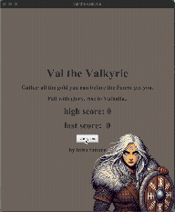
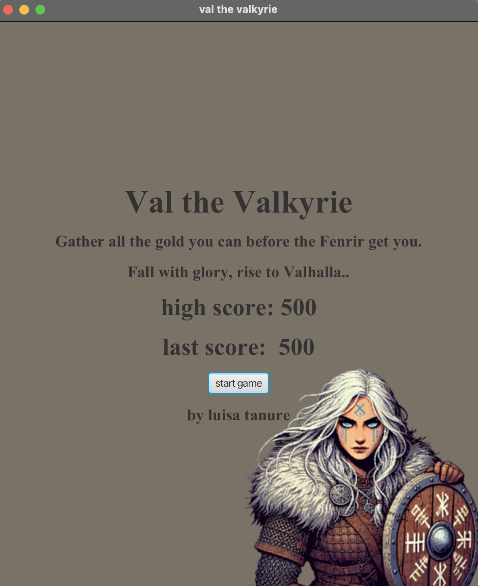
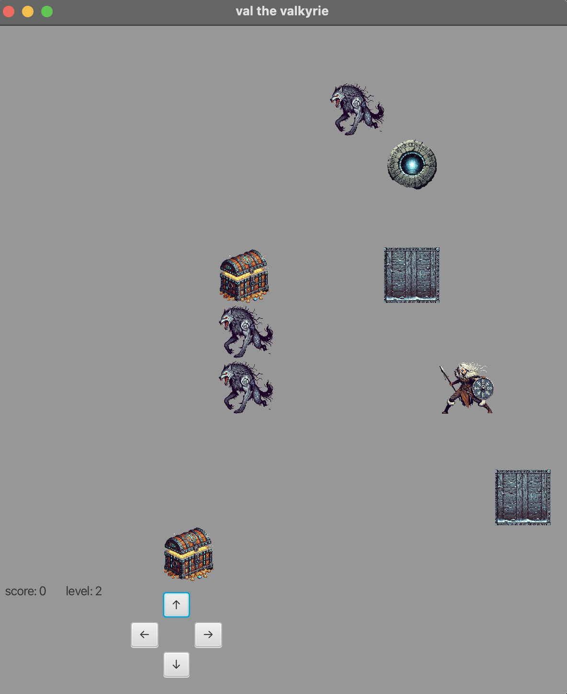

# Dungeon Crawler (Java + JavaFX)

A 2D dungeon crawler built in Java with a JavaFX UI. This project was created as a final course project and showcases a clean separation of responsibilities using MVC + the Observer pattern.

## Demo


## Gameplay
**Goal:** Explore each room, collect treasure, avoid enemies, and reach the exit to advance.





### Controls
- In-screen buttons

## Features
- Grid-based dungeon board with collectible treasure and enemies
- Multiple levels (reach exit → next level)
- Score tracking (current + high score)
- JavaFX-based UI that updates based on model changes (Observer pattern)

## Tech Stack
- Java (Maven)
- JavaFX (UI)

## Architecture
This project follows:
- **Model:** game state + rules (board, pieces, collisions, scoring)
- **View:** JavaFX UI rendering the board and HUD
- **Controller:** user input handling that calls model actions
- **Observer pattern:** view subscribes to model updates to refresh automatically

## Getting Started

### Prerequisites
- JDK installed (make sure your Java version matches what the project expects)
- Maven installed

### Run the game
```bash
mvn clean javafx:run